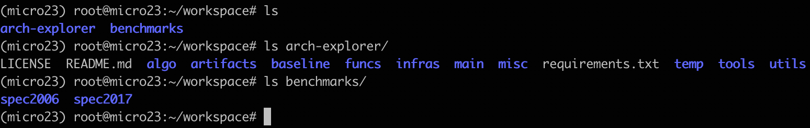

# Artifact Evaluation (AE) of ArchExplorer for MICRO 2023

## Abstract

The artifact contains ArchExplorer’s code and its setup and running descriptions.
We provide instructions and click-to-run scripts for reproducing the main results in this paper.
Specifically, we reproduce the results of Figure 2, Figure 3, Figure 12, Figure 13, Figure 14, and Figure 15.


## Overview

[1. Project Structure](#1-project-structure)  
[2. Getting Started](#2-getting-started) (5 human-minutes + 20 compute-minutes)  
[3. Run Experiments](#3-run-experiments) (10 human-minutes + 60 compute-minutes)  
[4. Validate Results](#4-validate-results) (15 human-minutes + 1 compute-minutes)  
[5. Appendix](#5-appendix)  

## 1. Project Structure

First of all, let's take a glance at the file structure of ArchExplorer.
We only list the main components here:

```
├── algo
├── artifacts                        # main directory for MICRO 2023 AE reviewers to reproduce results
├── baseline                         # baselines used in our papers
│     ├── adaboost
│     ├── archranker
│     ├── boom_explorer
│     └── calipers
├── funcs
│     ├── dataset_generation.py
│     ├── design
│     ├── initialize.py
│     ├── sim
│     └── simulation.py
├── infras
│     ├── calipers
│     ├── deg
│     ├── gem5-research
│     ├── gem5-research-calipers
│     ├── mcpat-research
├── LICENSE
├── main
│     ├── configs
│     └── main.py
├── tools
```
`algo`, `artifacts`, `baseline`, `funcs` are directories that we heavily develop and maintain/depend on.


Highlights of where we implement:

* `algo/core/model.py`, `infras/deg/src/graph/o3.h`: the new DEG data structures and induced DEG constructions.
* `algo/core/arch_bottleneck.py`, `infras/deg/src/graph/bottleneck.h`: our bottleneck analysis.
* `algo/dse.py`: bottleneck-removal-driven design space exploration.
* `funcs/sim/o3cpu/o3cpu_simulation.py`: the interfaces between our core and infrastructures.
* `infras/gem5-research`: modified GEM5 simulator to support the new DEG model.

## 2. Getting Started

### Hardware requirements

The artifact requires a high-end Linux server machine with at least 2 TB disk space.
The main memory should be at least 64 GB to support parallel compilation and simulations.

For reference, we list our system configurations here:

> * OS: Ubuntu 18.04
> * CPU: Intel Xeon Platinum 8163 CPU @ 2.50GHz (96 cores)
> * DRAM: 400GB
> * Disk: 9.6TB

### Software requirements

The minimum software dependencies include: 

> `pdflatex`
> 
> `gcc>=7.4.0`
> 
> `automake`
> 
> `protobuf`
> 
> `python==3.8.0`

The software dependencies are resolved by our provided docker environment.
Users are required to support docker commands in their machines if using our provided docker environment.

### Setup the docker environment

#### Get the ArchExplorer repo

The repo for artifact evaluation is archived in both Zenodo and GitHub.
During the AE process, we recommend the reviewers to get the repo through GitHub with our latest updates.

```bash
$ git clone https://github.com/baichen318/arch-explorer
```

Suppose the `arch-explorer` repo is located at `/path/to/arch-explorer`.

#### Prepare SPEC CPU Benchmarks

This step may take some time since it is necessary to prepare for the workflow.
Due to the SPEC CPU Benchmarks license, we cannot release benchmarks to the public.
You need to prepare SPEC CPU benchmarks and install them in a manner *w.r.t.* our accepted directories trees.

- Benchmark list

	+ SPEC CPU2006
	+ SPEC CPU2017 with Simpoints checkpoints

    We do not require SPEC CPU2006 Simpoints checkpoints but require SPEC CPU2017 Simpoints checkpoints.
    SPEC CPU2017 Simpoints checkpoints are created with an interval length equal to `10000000`, and warmup length equal to `1000000`.

- Benchmark installations: the directory tree should satisfy the examples so that ArchExplorer can conduct DSE automatically. [Appendix](#appendix) lists the required directory tree (only critical directories and files are shown).

	+ SPEC CPU benchmarks root directory tree: please see [Appendix 1](#appendix-1)
	+ SPEC CPU2006 directory tree: please see [Appendix 2](#appendix-2)
	+ SPEC CPU2017 directory & checkpoint tree: please see [Appendix 3](#appendix-3) and [Appendix 4](#appendix-4)

After SPEC CPU Benchmarks are ready, we suppose SPEC CPU2006 and CPU2017 are located at `/path/to/benchmarks/spec2006` and `/path/to/benchmarks/spec2017`, respectively (*i.e.*, both benchmarks are located under `/path/to/benchmarks` directory, and `/path/to/benchmarks/spec2017` includes `/path/to/benchmarks/spec2017/spec2017` and `/path/to/benchmarks/spec2017/checkpoint`, as shown in [Appendix 1](#appendix-1)).

#### Setup docker

* **Pull docker image**

```bash
$ docker run -it -d
  --name micro23 \ # docker environment name
  --hostname micro23 \ # host machine name
  --network=host \ # use the host network
  -v $(pwd):/root/workspace/arch-explorer \ # map the current path (arch-explorer's root path) to docker's path: /root/workspace/arch-explorer
  -v /path/to/benchmarks:/root/workspace/benchmarks \ # map reviewers' provided SPEC CPU benchmarks root path to docker's path: /root/workspace/benchmarks. Users need to provide SPEC CPU benchmarks, and the benchmark preparations are discussed below.
  -w /root/workspace \ # workspace root path
  docker.io/troore/arch-explorer:2.0 # `username` is `troore`, tag id is `2.0`
```

* **Enter the docker image**

```bash
$ docker exec -it micro23 /bin/bash
```

Since reviewers have already set the directories mapping by executing `docker run` command, arch-explorer's codes should be placed in `/root/workspace/arch-explorer`, and SPEC CPU benchmarks are placed in `/root/workspace/benchmarks` once reviewers enter the docker image.



The figure above shows the directory tree once reviewers enter the docker image.


## 3. Run Experiments

### Basic Setup

After reviewers enter the docker image, please execute following command to build & config. infrastructures that ArchExplorer depends.

```bash
$ cd /path/to/arch-explorer && ./tools/settings.sh
$ export PYTHONPATH=`pwd`
```

<!-- Then, reviewers need to setup the benchmark paths:

```bash
$ cd artifacts
$ vim configs/artifacts.yml
```

In `artifacts.yml`, fill `spec2006/benchmark-root` with the SPEC CPU2006 benchmarks root path.
One possible root path could be `/root/workspace/benchmarks/spec2006`.
Fill `spec2017/benchmark-root` with the SPEC CPU2017 benchmarks root path. One possible root path could be `/root/workspace/benchmarks/spec2017/spec2017`.
Fill `spec2017/checkpoint-root` with the SPEC CPU2017 Simpoints checkpoints root path. One possible root path could be `/root/workspace/benchmarks/spec2017/checkpoint`. -->

### Run with 3 benchmark modes

There are three possible factors that will probably prevent reviewers reproducing our paper results:

1. benchmark availability
2. hard-coded workload paths
3. long runtime

We assume that SPEC CPU benchmarks are available for reviewers. 
However, if it is not true, we provide a **demo mode** for reviewers successfully run through some of our experiments.
Under the **demo mode**, we use open source riscv workloads (*i.e.*, [riscv-tests](https://github.com/riscv-software-src/riscv-tests)) rather than SPEC CPU benchmarks.

Moreover, some SPEC benchmarks MUST contain hard-coded workloads absolute paths, *e.g.*, SPEC CPU2006 workload: `464.h264ref`.
These hard-coded paths would prevent reviewers reproducing results in a push-button way.
Human efforts are required to configure the hard-coded paths before results related to these benchmarks are expected.

Last, the whole process for reproducing all original results in our paper will take approximately 15 days on our testing systems (for high-end Linux server machines, *e.g.*, 80 cores of Intel(R) Xeon(R) CPU E7-4820 v3 @ 1.90GHz with 1 TB main memory).

Therefore, if reviewers have SPEC CPU benchmarks, and do not want to manually resolve the hard-coded paths, or cannot accept the long runtime, we set a mode called **partial mode** in which only the benchmarks without hard-coded paths will be run.

We also provide the **full mode** which can reproduce the exactly same results as our paper.


#### Demo Mode (5 hours)

- Execution

```bash
$ cd arch-explorer/artifacts/
$ ./exp_demo_mode.sh
```

- Results

```bash
$ open fig2/fig2.pdf
$ open fig3/fig3.pdf
```

#### Partial Mode (9 days)

- Execution

```bash
$ cd /path/to/arch-explorer/artifacts
$ ./exp_partial_mode.sh
```

- Results

```bash
$ open fig2/fig2.pdf
$ open fig3/fig3.pdf
$ open fig12/spec06/archranker-partial-spec06.pdf
$ open fig12/spec06/adaboost-partial-spec06.pdf
$ open fig12/spec06/boom_explorer-partial-spec06.pdf
$ open fig12/spec06/archexplorer-partial-spec06.pdf
$ open fig13/fig13.pdf
$ open fig14/fig14_partial_mode.pdf
$ open fig15/fig15_partial_mode.pdf
```

#### Full Mode (15 days)

Before running in the full mode, reviewers are required to reconfigure SPEC CPU benchmarks as described below:

- Benchmark reconfigurations
 
    After reviewers enter the docker image, some benchmarks should be reconfigured to support the simulations. Otherwise, those benchmarks would be failed in simulations and stuck the entire program. The reconfiguration is due to SPEC CPU benchmarks hardcoded files' absolute root path. And the only feasible solution is to reconfigure them manually after reviewers enter the docker image. The reconfiguration method is shown below:

	+ SPEC CPU2006

		* `464.h264ref`: in `foreman_ref_encoder_baseline.cfg`, reconfigure the ‘InputFile’ with the absolute root path of ‘foreman_qcif.yuv’. The absolute path depends on the reviewers’ machines. One possible absolute path could be `/root/workspace/benchmarks/spec2006/spec2006_int_ref_public/464.h264ref/foreman_qcif.yuv`
		
	+ SPEC CPU2017
	
		* `600.perlbench_s`, `623.xalancbmk_s`, `623.x264_s`, `638.imagick_s`: reconfigure `m5.cpt` of each Simpoints checkpoints. In `m5.cpt`, assign '_fileName' with the absolute path of the benchmark input file.
		For example, open the file: `/root/workspace/benchmarks/spec2017/checkpoint/600.perlbench_s/600.perlbench_s-checkpoint/cpt.simpoint_13_inst_569000000_weight_0.151515_interval_10000000_warmup_1000000/m5.cpt`, and revise '_fileName' to `_fileName=/root/workspace/benchmarks/spec2017/spec2017/600.perlbench_s/run/run_base_refspeed_rv64g-gcc-9.2-64.0000/lib/mailcomp.pm`. The file root path of `mailcomp.pm` depends on the reviewers' machines.

    <!-- If you do not reconfigure benchmarks after you enter the docker image, different experimental results may expect. Once you reconfigure the benchmarks, you can simulate with all benchmarks. The steps to simulate all benchmarks in the experiments are described in `fig2/README.md` and `fig3/README.md`, respectively. -->

- Execution

```bash
$ cd /path/to/arch-explorer/artifacts
$ ./exp_full_mode.sh
```

- Results

```bash
$ open fig2/fig2.pdf
$ open fig3/fig3.pdf
$ open fig12/spec06/archranker-full-spec06.pdf
$ open fig12/spec06/adaboost-full-spec06.pdf
$ open fig12/spec06/boom_explorer-full-spec06.pdf
$ open fig12/spec06/archexplorer-full-spec06.pdf
$ open fig13/fig13.pdf
$ open fig14/fig14_full_mode.pdf
$ open fig15/fig15_full_mode.pdf
```


<!-- ## Pre-requisites

Please read `/path/to/arch-explorer/README.md` to finish settings (i.e., the second step in `/path/to/arch-explorer/README.md`).

The pre-requisites includes:

- `PYTHONPATH` settings.
- Miscellaneous tools compilations (GEM5, McPAT, DEG, etc.).
- Benchmarks preparation.
- Other settings.
	+ Configurate the benchmark root path:
	```bash
	$ cd /path/to/arch-explorer/artifacts
	$ vim configs/artifacts.yml
	```
	* Modify `spec06`/`benchmark-root` as your SPEC CPU2006 root path.

	* Modify `spec17`/`benchmark-root` as your SPEC CPU2017 root path.

	* Modify `spec17`/`checkpoint-root` as your SPEC CPU2017 Simpoints checkpoints root path. -->

## 4. Validate Results

Check the results produced in the corresponding sub-directory.
The outputs of this artifact are figures with in PDF format to reproduce the main results in the paper.

Besides the push-button way illustrated in [Running Experiments](#3-run-experiments), reviewers can enter into subdirectories, *e.g.*, `artifacts/fig2` to reproduce the results with special interest. 
Please enter the corresponding directory to read `README.md`, respectively.


## 5. Appendix

### Appendix 1

- SPEC CPU benchmarks root directory tree (in the docker image):
```bash
/root/workspace/benchmarks/
├── spec2006
└── spec2017
      ├── spec2017
      └── checkpoint
```

### Appendix 2

- SPEC CPU2006 directory tree (the asterisk `*` is a wildcard character):
```bash
spec2006/
├── spec2006_fp_ref_public
│     ├── 444.namd
│     │     ├── 444.namd.riscv
│     │     ├── namd.input
│     │     ├── obj
│     │     │     ├── 0_Molecule.o
│     │     │     └── *.o
│     ├── 447.dealII
│     │     ├── 447.dealII.riscv
│     │     ├── DummyData
│     │     ├── grid-0.eps
│     │     ├── *.eps
│     │     ├── obj
│     │     │     ├── 0_auto_derivative_function.o
│     │     │     └── *.o
│     │     ├── solution-0.gmv
│     │     └── *.gmv
│     ├── 450.soplex
│     │     ├── 450.soplex.riscv
│     │     ├── obj
│     │     │     ├── 0_idxset.o
│     │     │     └── *.o
│     │     ├── pds-50.mps
│     │     ├── pds-50.mps.info
│     │     ├── ref.mps
│     │     ├── ref.mps.info
│     └── 453.povray
│           ├── 453.povray.riscv
│           ├── arrays.inc
│           ├── chars.inc
│           ├── colors.inc
│           ├── consts.inc
│           ├── crystal.ttf
│           ├── cyrvetic.ttf
│           ├── debug.inc
│           ├── obj
│           │     ├── 0_userio.o
│           │     └── *.o
│           ├── povlogo.ttf
│           ├── SPEC-benchmark.log
│           ├── SPEC-benchmark-ref.ini
│           ├── SPEC-benchmark-ref.pov
│           ├── SPEC-benchmark.tga
│           └── *.inc
└── spec2006_int_ref_public
    ├── 401.bzip2
    │     ├── 401.bzip2.riscv
    │     ├── chicken.jpg
    │     ├── input.combined
    │     ├── input.program
    │     ├── input.source
    │     ├── liberty.jpg
    │     ├── obj
    │     │     ├── 0_crctable.o
    │     │     └── *.o
    │     └── text.html
    ├── 429.mcf
    │     ├── 429.mcf.riscv
    │     ├── inp.in
    │     ├── mcf.out
    │     └── obj
    │           ├── 0_mcf.o
    │           └── *.o
    ├── 456.hmmer
    │     ├── 456.hmmer.riscv
    │     ├── nph3.hmm
    │     ├── obj
    │     │     ├── 0_sqerror.o
    │     │     └── *.o
    │     ├── retro.hmm
    │     ├── retro.hmm.new
    │     └── swiss41
    ├── 458.sjeng
    │     ├── 458.sjeng.riscv
    │     ├── obj
    │     │     ├── 0_book.o
    │     │     └── *.o
    │     └── ref.txt
    ├── 462.libquantum
    │     ├── 462.libquantum.riscv
    │     └── obj
    │           ├── 0_omuln.o
    │           └── *.o
    ├── 464.h264ref
    │     ├── 464.h264ref.riscv
    │     ├── encoded_main.264
    │     ├── foreman_qcif.264
    │     ├── foreman_qcif.yuv
    │     ├── foreman_ref_baseline_leakybucketparam.cfg
    │     ├── foreman_ref_encoder_baseline.cfg
    │     ├── *.cfg
    │     ├── obj
    │     │     ├── 0_nal.o
    │     │     └── *.o
    │     ├── sss.264
    │     ├── sss_encoder_main.cfg
    │     ├── sss_main_leakybucketparam.cfg
    │     └── sss.yuv
    ├── 471.omnetpp
    │     ├── 471.omnetpp.riscv
    │     ├── obj
    │     │     ├── 0_eth-index_n.o
    │     │     └── *.o
    │     ├── omnetpp.ini
    │     └── omnetpp.sca
    └── 483.xalancbmk
          ├── 100mb.xsd
          ├── 483.xalancbmk.riscv
          ├── obj
          │     ├── 0_AIXPlatformUtils.o
          │     └── *.o
          ├── ref.lst
          ├── t5.xml
          └── xalanc.xsl
```

### Appendix 3

- SPEC CPU2017 directory tree (the asterisk `*` is a wildcard character):
```bash
spec2017/
    ├── 500.perlbench_r
    │     └── run
    │           └── run_base_refspeed_rv64g-gcc-9.2-64.0000
    │               ├── checkspam.pl
    │               └── perlbench_s_base.rv64g-gcc-9.2-64
    ├── 602.gcc_s
    │     └── run
    │           └── run_base_refspeed_rv64g-gcc-9.2-64.0000
    │               ├── control
    │               ├── gcc-pp.c
    │               ├── gcc-pp.opts-O5_-fipa-pta.err
    │               ├── gcc-pp.opts-O5_-fipa-pta.out
    │               ├── gcc-pp.opts-O5_-fipa-pta.s
    │               ├── sgcc_base.rv64g-gcc-9.2-64
    │               ├── speccmds.cmd
    │               └── speccmds.*
    ├── 605.mcf_s
    │     └── run
    │           └── run_base_refspeed_rv64g-gcc-9.2-64.0000
    │               ├── control
    │               ├── inp.err
    │               ├── inp.in
    │               ├── inp.out
    │               ├── mcf_s_base.rv64g-gcc-9.2-64
    │               ├── speccmds.cmd
    │               └── speccmds.*
    ├── 607.cactuBSSN_s
    │     └── run
    │           └── run_base_refspeed_rv64g-gcc-9.2-64.0000
    │               ├── cactuBSSN_s_base.rv64g-gcc-9.2-64
    │               ├── control
    │               ├── speccmds.cmd
    │               ├── speccmds.*
    │               ├── spec_ref.err
    │               └── spec_ref.*
    ├── 619.lbm_s
    │     └── run
    │           └── run_base_refspeed_rv64g-gcc-9.2-64.0000
    │               ├── 200_200_260_ldc.of
    │               ├── lbm.*
    │               ├── lbm_s_base.rv64g-gcc-9.2-64
    │               ├── speccmds.cmd
    │               └── speccmds.*
    ├── 621.wrf_s
    │     └── run
    │           └── run_base_refspeed_rv64g-gcc-9.2-64.0000
    │               ├── CAM_ABS_DATA
    │               ├── CAM_AEROPT_DATA
    │               ├── co2_trans
    │               ├── control
    │               ├── diffwrf_621_base.rv64g-gcc-9.2-64
    │               ├── ETAMPNEW_DATA
    │               ├── GENPARM.TBL
    │               ├── grib2map.tbl
    │               ├── gribmap.txt
    │               ├── LANDUSE.TBL
    │               ├── namelist.input
    │               ├── namelist.output
    │               ├── OBS_DOMAIN101
    │               ├── OBS_DOMAIN201
    │               ├── ozone.formatted
    │               ├── ozone_lat.formatted
    │               ├── ozone_plev.formatted
    │               ├── RRTM_DATA
    │               ├── RRTMG_LW_DATA
    │               ├── RRTMG_SW_DATA
    │               ├── rsl.out.0000
    │               ├── SOILPARM.TBL
    │               ├── speccmds.cmd
    │               ├── speccmds.*
    │               ├── speccmds.stdout
    │               ├── tr49t67
    │               ├── tr49t85
    │               ├── tr67t85
    │               ├── URBPARM.TBL
    │               ├── VEGPARM.TBL
    │               ├── VEGPARM.TBLa
    │               ├── wrfbdy_d01
    │               ├── wrf.err
    │               ├── wrfinput_d01
    │               ├── wrf_s_base.rv64g-gcc-9.2-64
    │               └── wrfsfdda_d01
    ├── 623.xalancbmk_s
    │     └── run
    │           └── run_base_refspeed_rv64g-gcc-9.2-64.0000
    │               ├── 100mb.xsd
    │               ├── ref.lst
    │               ├── ref-t5.err
    │               ├── ref-t5.out
    │               ├── speccmds.cmd
    │               ├── speccmds.*
    │               ├── t5.xml
    │               ├── xalancbmk_s_base.rv64g-gcc-9.2-64
    │               └── xalanc.xsl
    ├── 625.x264_s
    │     └── run
    │           └── run_base_refspeed_rv64g-gcc-9.2-64.0000
    │               ├── BuckBunny.264
    │               ├── 'BuckBunny_New.264
    │               ├── BuckBunny.yuv
    │               ├── control
    │               ├── imagevalidate_625_base.rv64g-gcc-9.2-64
    │               ├── inputgen.cmd
    │               ├── inputgen_ldecod_s_base.rv64g-gcc-9.2-64_x264.err
    │               ├── inputgen_ldecod_s_base.rv64g-gcc-9.2-64_x264.out
    │               ├── inputgen.*
    │               ├── ldecod_s_base.rv64g-gcc-9.2-64
    │               ├── x264_s_base.rv64g-gcc-9.2-64
    │               ├── x264_stats.log.mbtree.temp
    │               └── x264_stats.log.temp
    ├── 627.cam4_s
    │     └── run
    │           └── run_base_refspeed_rv64g-gcc-9.2-64.0000
    │               ├── abs_ems_factors_fastvx.c030508.nc
    │               ├── aero_1.9x2.5_L26_2000clim_c091112.nc
    │               ├── atm_in
    │               ├── bcphi_camrt_c080918.nc
    │               ├── bcpho_camrt_c080918.nc
    │               ├── cam4_s_base.rv64g-gcc-9.2-64
    │               ├── cam4_s_base.rv64g-gcc-9.2-64.err
    │               ├── cam4_s_base.rv64g-gcc-9.2-64.txt
    │               ├── cam4_validate_627_base.rv64g-gcc-9.2-64
    │               ├── cami_0000-01-01_1.9x2.5_L26_APE_c080203.nc
    │               ├── clim_p_trop.nc
    │               ├── drv_flds_in
    │               ├── drv_in
    │               ├── dust1_camrt_c080918.nc
    │               ├── dust2_camrt_c080918.nc
    │               ├── dust3_camrt_c080918.nc
    │               ├── dust4_camrt_c080918.nc
    │               ├── ocphi_camrt_c080918.nc
    │               ├── ocpho_camrt_c080918.nc
    │               ├── ozone_1.9x2.5_L26_2000clim_c091112.nc
    │               ├── speccmds.cmd
    │               ├── speccmds.*
    │               ├── ssam_camrt_c080918.nc
    │               ├── sscm_camrt_c080918.nc
    │               ├── sulfate_camrt_c080918.nc
    │               └── USGS-gtopo30_1.9x2.5_remap_c050602.nc
    ├── 628.pop2_s
    │     └── run
    │           └── run_base_refspeed_rv64g-gcc-9.2-64.0000
    │               └── speed_pop2_base.rv64g-gcc-9.2-64
    ├── 631.deepsjeng_s
    │     └── run
    │           └── run_base_refspeed_rv64g-gcc-9.2-64.0000
    │               ├── deepsjeng_s_base.rv64g-gcc-9.2-64
    │               ├── ref.err
    │               ├── ref.out
    │               ├── ref.txt
    │               ├── speccmds.cmd
    │               └── speccmds.*
    ├── 638.imagick_s
    │     └── run
    │           └── run_base_refspeed_rv64g-gcc-9.2-64.0000
    │               ├── control
    │               ├── imagevalidate_638_base.rv64g-gcc-9.2-64
    │               ├── imagick_s_base.rv64g-gcc-9.2-64
    │               ├── refspeed_convert.err
    │               ├── refspeed_convert.out
    │               ├── refspeed_input.tga
    │               ├── speccmds.cmd
    │               └── speccmds.*
    ├── 641.leela_s
    │     └── run
    │           └── run_base_refspeed_rv64g-gcc-9.2-64.0000
    │               ├── leela_s_base.rv64g-gcc-9.2-64
    │               ├── ref.err
    │               ├── ref.out
    │               ├── ref.sgf
    │               ├── speccmds.cmd
    │               └── speccmds.*
    ├── 644.nab_s
    │     └── run
    │           └── run_base_refspeed_rv64g-gcc-9.2-64.0000
    │               ├── 3j1n
    │               │     ├── 3j1n.pdb
    │               │     └── 3j1n.prm
    │               ├── 3j1n.err
    │               ├── 3j1n.out
    │               ├── control
    │               ├── nab_s_base.rv64g-gcc-9.2-64
    │               ├── speccmds.cmd
    │               └── speccmds.*
    └── 657.xz_s
          └── run
                └── run_base_refspeed_rv64g-gcc-9.2-64.0000
                    ├── cld.tar.xz
                    ├── control
                    ├── cpu2006docs.tar-6643-4.err
                    ├── cpu2006docs.tar-6643-4.out
                    ├── cpu2006docs.tar.xz
                    ├── input.combined.xz
                    ├── speccmds.cmd
                    ├── speccmds.*
                    └── xz_s_base.rv64g-gcc-9.2-64
```

### Appendix 4

- SPEC CPU2017 checkpoint directory tree:
```bash
checkpoint/
├── 600.perlbench_s
│     ├── 600.perlbench_s-checkpoint
│     │     ├── config.ini
│     │     ├── config.json
│     │     ├── cpt.simpoint_00_inst_29000000_weight_0.040404_interval_10000000_warmup_1000000
│     │     │     ├── m5.cpt
│     │     │     └── system.physmem.store0.pmem
│     │     ├── cpt.simpoint_01_inst_39000000_weight_0.010101_interval_10000000_warmup_1000000
│     │     │     ├── m5.cpt
│     │     │     └── system.physmem.store0.pmem
│     │     ├── cpt.simpoint_02_inst_69000000_weight_0.080808_interval_10000000_warmup_1000000
│     │     │     ├── m5.cpt
│     │     │     └── system.physmem.store0.pmem
│     │     ├── cpt.simpoint_03_inst_79000000_weight_0.020202_interval_10000000_warmup_1000000
│     │     │     ├── m5.cpt
│     │     │     └── system.physmem.store0.pmem
│     │     ├── cpt.simpoint_04_inst_179000000_weight_0.040404_interval_10000000_warmup_1000000
│     │     │     ├── m5.cpt
│     │     │     └── system.physmem.store0.pmem
│     │     ├── cpt.simpoint_05_inst_269000000_weight_0.030303_interval_10000000_warmup_1000000
│     │     │     ├── m5.cpt
│     │     │     └── system.physmem.store0.pmem
│     │     ├── cpt.simpoint_06_inst_279000000_weight_0.070707_interval_10000000_warmup_1000000
│     │     │     ├── m5.cpt
│     │     │     └── system.physmem.store0.pmem
│     │     ├── cpt.simpoint_07_inst_299000000_weight_0.010101_interval_10000000_warmup_1000000
│     │     │     ├── m5.cpt
│     │     │     └── system.physmem.store0.pmem
│     │     ├── cpt.simpoint_08_inst_329000000_weight_0.050505_interval_10000000_warmup_1000000
│     │     │     ├── m5.cpt
│     │     │     └── system.physmem.store0.pmem
│     │     ├── cpt.simpoint_09_inst_359000000_weight_0.010101_interval_10000000_warmup_1000000
│     │     │     ├── m5.cpt
│     │     │     └── system.physmem.store0.pmem
│     │     ├── cpt.simpoint_10_inst_369000000_weight_0.030303_interval_10000000_warmup_1000000
│     │     │     ├── m5.cpt
│     │     │     └── system.physmem.store0.pmem
│     │     ├── cpt.simpoint_11_inst_429000000_weight_0.050505_interval_10000000_warmup_1000000
│     │     │     ├── m5.cpt
│     │     │     └── system.physmem.store0.pmem
│     │     ├── cpt.simpoint_12_inst_439000000_weight_0.010101_interval_10000000_warmup_1000000
│     │     │     ├── m5.cpt
│     │     │     └── system.physmem.store0.pmem
│     │     ├── cpt.simpoint_13_inst_569000000_weight_0.151515_interval_10000000_warmup_1000000
│     │     │     ├── m5.cpt
│     │     │     └── system.physmem.store0.pmem
│     │     ├── cpt.simpoint_14_inst_599000000_weight_0.010101_interval_10000000_warmup_1000000
│     │     │     ├── m5.cpt
│     │     │     └── system.physmem.store0.pmem
│     │     ├── cpt.simpoint_15_inst_609000000_weight_0.010101_interval_10000000_warmup_1000000
│     │     │     ├── m5.cpt
│     │     │     └── system.physmem.store0.pmem
│     │     ├── cpt.simpoint_16_inst_619000000_weight_0.010101_interval_10000000_warmup_1000000
│     │     │     ├── m5.cpt
│     │     │     └── system.physmem.store0.pmem
│     │     ├── cpt.simpoint_17_inst_629000000_weight_0.010101_interval_10000000_warmup_1000000
│     │     │     ├── m5.cpt
│     │     │     └── system.physmem.store0.pmem
│     │     ├── cpt.simpoint_18_inst_639000000_weight_0.010101_interval_10000000_warmup_1000000
│     │     │     ├── m5.cpt
│     │     │     └── system.physmem.store0.pmem
│     │     ├── cpt.simpoint_19_inst_649000000_weight_0.010101_interval_10000000_warmup_1000000
│     │     │     ├── m5.cpt
│     │     │     └── system.physmem.store0.pmem
│     │     ├── cpt.simpoint_20_inst_689000000_weight_0.050505_interval_10000000_warmup_1000000
│     │     │     ├── m5.cpt
│     │     │     └── system.physmem.store0.pmem
│     │     ├── cpt.simpoint_21_inst_709000000_weight_0.010101_interval_10000000_warmup_1000000
│     │     │     ├── m5.cpt
│     │     │     └── system.physmem.store0.pmem
│     │     ├── cpt.simpoint_22_inst_719000000_weight_0.020202_interval_10000000_warmup_1000000
│     │     │     ├── m5.cpt
│     │     │     └── system.physmem.store0.pmem
│     │     ├── cpt.simpoint_23_inst_739000000_weight_0.010101_interval_10000000_warmup_1000000
│     │     │     ├── m5.cpt
│     │     │     └── system.physmem.store0.pmem
│     │     ├── cpt.simpoint_24_inst_779000000_weight_0.070707_interval_10000000_warmup_1000000
│     │     │     ├── m5.cpt
│     │     │     └── system.physmem.store0.pmem
│     │     ├── cpt.simpoint_25_inst_829000000_weight_0.020202_interval_10000000_warmup_1000000
│     │     │     ├── m5.cpt
│     │     │     └── system.physmem.store0.pmem
│     │     ├── cpt.simpoint_26_inst_859000000_weight_0.111111_interval_10000000_warmup_1000000
│     │     │     ├── m5.cpt
│     │     │     └── system.physmem.store0.pmem
│     │     ├── cpt.simpoint_27_inst_959000000_weight_0.040404_interval_10000000_warmup_1000000
│     │     │     ├── m5.cpt
│     │     │     └── system.physmem.store0.pmem
│     │     ├── fs
│     │     │     ├── proc
│     │     │     │     ├── cpuinfo
│     │     │     │     └── stat
│     │     │     ├── sys
│     │     │     │     └── devices
│     │     │     │         └── system
│     │     │     │             └── cpu
│     │     │     │                 ├── online
│     │     │     │                 └── possible
│     │     │     └── tmp
│     │     └── stats.txt
│     └── 600.perlbench_s-init
│         ├── config.ini
│         ├── config.json
│         ├── fs
│         │     ├── proc
│         │     │     ├── cpuinfo
│         │     │     └── stat
│         │     ├── sys
│         │     │     └── devices
│         │     │         └── system
│         │     │             └── cpu
│         │     │                 ├── online
│         │     │                 └── possible
│         │     └── tmp
│         ├── simpoint.bb.gz
│         └── stats.txt
├── 602.gcc_s
│     ├── 602.gcc_s-checkpoint
│     │     ├── config.ini
│     │     ├── config.json
│     │     ├── cpt.simpoint_00_inst_0_weight_0.010101_interval_10000000_warmup_0
│     │     │     ├── m5.cpt
│     │     │     └── system.physmem.store0.pmem
│     │     ├── cpt.simpoint_01_inst_239000000_weight_0.030303_interval_10000000_warmup_1000000
│     │     │     ├── m5.cpt
│     │     │     └── system.physmem.store0.pmem
│     │     ├── cpt.simpoint_02_inst_249000000_weight_0.080808_interval_10000000_warmup_1000000
│     │     │     ├── m5.cpt
│     │     │     └── system.physmem.store0.pmem
│     │     ├── cpt.simpoint_03_inst_299000000_weight_0.131313_interval_10000000_warmup_1000000
│     │     │     ├── m5.cpt
│     │     │     └── system.physmem.store0.pmem
│     │     ├── cpt.simpoint_04_inst_319000000_weight_0.101010_interval_10000000_warmup_1000000
│     │     │     ├── m5.cpt
│     │     │     └── system.physmem.store0.pmem
│     │     ├── cpt.simpoint_05_inst_489000000_weight_0.101010_interval_10000000_warmup_1000000
│     │     │     ├── m5.cpt
│     │     │     └── system.physmem.store0.pmem
│     │     ├── cpt.simpoint_06_inst_499000000_weight_0.191919_interval_10000000_warmup_1000000
│     │     │     ├── m5.cpt
│     │     │     └── system.physmem.store0.pmem
│     │     ├── cpt.simpoint_07_inst_509000000_weight_0.262626_interval_10000000_warmup_1000000
│     │     │     ├── m5.cpt
│     │     │     └── system.physmem.store0.pmem
│     │     ├── cpt.simpoint_08_inst_689000000_weight_0.040404_interval_10000000_warmup_1000000
│     │     │     ├── m5.cpt
│     │     │     └── system.physmem.store0.pmem
│     │     ├── cpt.simpoint_09_inst_939000000_weight_0.050505_interval_10000000_warmup_1000000
│     │     │     ├── m5.cpt
│     │     │     └── system.physmem.store0.pmem
│     │     ├── fs
│     │     │     ├── proc
│     │     │     │     ├── cpuinfo
│     │     │     │     └── stat
│     │     │     ├── sys
│     │     │     │     └── devices
│     │     │     │         └── system
│     │     │     │             └── cpu
│     │     │     │                 ├── online
│     │     │     │                 └── possible
│     │     │     └── tmp
│     │     └── stats.txt
│     └── 602.gcc_s-init
│         ├── config.ini
│         ├── config.json
│         ├── fs
│         │     ├── proc
│         │     │     ├── cpuinfo
│         │     │     └── stat
│         │     ├── sys
│         │     │     └── devices
│         │     │         └── system
│         │     │             └── cpu
│         │     │                 ├── online
│         │     │                 └── possible
│         │     └── tmp
│         ├── simpoint.bb.gz
│         └── stats.txt
├── 605.mcf_s
│     ├── 605.mcf_s-checkpoint
│     │     ├── config.ini
│     │     ├── config.json
│     │     ├── cpt.simpoint_00_inst_0_weight_0.050000_interval_10000000_warmup_0
│     │     │     ├── m5.cpt
│     │     │     └── system.physmem.store0.pmem
│     │     ├── cpt.simpoint_01_inst_79000000_weight_0.220000_interval_10000000_warmup_1000000
│     │     │     ├── m5.cpt
│     │     │     └── system.physmem.store0.pmem
│     │     ├── cpt.simpoint_02_inst_259000000_weight_0.170000_interval_10000000_warmup_1000000
│     │     │     ├── m5.cpt
│     │     │     └── system.physmem.store0.pmem
│     │     ├── cpt.simpoint_03_inst_439000000_weight_0.010000_interval_10000000_warmup_1000000
│     │     │     ├── m5.cpt
│     │     │     └── system.physmem.store0.pmem
│     │     ├── cpt.simpoint_04_inst_449000000_weight_0.010000_interval_10000000_warmup_1000000
│     │     │     ├── m5.cpt
│     │     │     └── system.physmem.store0.pmem
│     │     ├── cpt.simpoint_05_inst_489000000_weight_0.050000_interval_10000000_warmup_1000000
│     │     │     ├── m5.cpt
│     │     │     └── system.physmem.store0.pmem
│     │     ├── cpt.simpoint_06_inst_649000000_weight_0.280000_interval_10000000_warmup_1000000
│     │     │     ├── m5.cpt
│     │     │     └── system.physmem.store0.pmem
│     │     ├── cpt.simpoint_07_inst_909000000_weight_0.210000_interval_10000000_warmup_1000000
│     │     │     ├── m5.cpt
│     │     │     └── system.physmem.store0.pmem
│     │     ├── fs
│     │     │     ├── proc
│     │     │     │     ├── cpuinfo
│     │     │     │     └── stat
│     │     │     ├── sys
│     │     │     │     └── devices
│     │     │     │         └── system
│     │     │     │             └── cpu
│     │     │     │                 ├── online
│     │     │     │                 └── possible
│     │     │     └── tmp
│     │     └── stats.txt
│     └── 605.mcf_s-init
│         ├── config.ini
│         ├── config.json
│         ├── fs
│         │     ├── proc
│         │     │     ├── cpuinfo
│         │     │     └── stat
│         │     ├── sys
│         │     │     └── devices
│         │     │         └── system
│         │     │             └── cpu
│         │     │                 ├── online
│         │     │                 └── possible
│         │     └── tmp
│         ├── simpoint.bb.gz
│         └── stats.txt
├── 607.cactuBSSN_s
│     ├── 607.cactuBSSN_s-checkpoint
│     │     ├── config.ini
│     │     ├── config.json
│     │     ├── cpt.simpoint_00_inst_9000000_weight_0.060606_interval_10000000_warmup_1000000
│     │     │     ├── m5.cpt
│     │     │     └── system.physmem.store0.pmem
│     │     ├── cpt.simpoint_01_inst_59000000_weight_0.020202_interval_10000000_warmup_1000000
│     │     │     ├── m5.cpt
│     │     │     └── system.physmem.store0.pmem
│     │     ├── cpt.simpoint_02_inst_69000000_weight_0.414141_interval_10000000_warmup_1000000
│     │     │     ├── m5.cpt
│     │     │     └── system.physmem.store0.pmem
│     │     ├── cpt.simpoint_03_inst_899000000_weight_0.505051_interval_10000000_warmup_1000000
│     │     │     ├── m5.cpt
│     │     │     └── system.physmem.store0.pmem
│     │     ├── fs
│     │     │     ├── proc
│     │     │     │     ├── cpuinfo
│     │     │     │     └── stat
│     │     │     ├── sys
│     │     │     │     └── devices
│     │     │     │         └── system
│     │     │     │             └── cpu
│     │     │     │                 ├── online
│     │     │     │                 └── possible
│     │     │     └── tmp
│     │     └── stats.txt
│     └── 607.cactuBSSN_s-init
│         ├── config.ini
│         ├── config.json
│         ├── fs
│         │     ├── proc
│         │     │     ├── cpuinfo
│         │     │     └── stat
│         │     ├── sys
│         │     │     └── devices
│         │     │         └── system
│         │     │             └── cpu
│         │     │                 ├── online
│         │     │                 └── possible
│         │     └── tmp
│         ├── simpoint.bb.gz
│         └── stats.txt
├── 619.lbm_s
│     ├── 619.lbm_s-checkpoint
│     │     ├── config.ini
│     │     ├── config.json
│     │     ├── cpt.simpoint_00_inst_9000000_weight_0.480000_interval_10000000_warmup_1000000
│     │     │     ├── m5.cpt
│     │     │     └── system.physmem.store0.pmem
│     │     ├── cpt.simpoint_01_inst_479000000_weight_0.010000_interval_10000000_warmup_1000000
│     │     │     ├── m5.cpt
│     │     │     └── system.physmem.store0.pmem
│     │     ├── cpt.simpoint_02_inst_489000000_weight_0.050000_interval_10000000_warmup_1000000
│     │     │     ├── m5.cpt
│     │     │     └── system.physmem.store0.pmem
│     │     ├── cpt.simpoint_03_inst_859000000_weight_0.460000_interval_10000000_warmup_1000000
│     │     │     ├── m5.cpt
│     │     │     └── system.physmem.store0.pmem
│     │     ├── fs
│     │     │     ├── proc
│     │     │     │     ├── cpuinfo
│     │     │     │     └── stat
│     │     │     ├── sys
│     │     │     │     └── devices
│     │     │     │         └── system
│     │     │     │             └── cpu
│     │     │     │                 ├── online
│     │     │     │                 └── possible
│     │     │     └── tmp
│     │     └── stats.txt
│     └── 619.lbm_s-init
│         ├── config.ini
│         ├── config.json
│         ├── fs
│         │     ├── proc
│         │     │     ├── cpuinfo
│         │     │     └── stat
│         │     ├── sys
│         │     │     └── devices
│         │     │         └── system
│         │     │             └── cpu
│         │     │                 ├── online
│         │     │                 └── possible
│         │     └── tmp
│         ├── simpoint.bb.gz
│         └── stats.txt
├── 621.wrf_s
│     ├── 621.wrf_s-checkpoint
│     │     ├── config.ini
│     │     ├── config.json
│     │     ├── cpt.simpoint_00_inst_9000000_weight_0.252525_interval_10000000_warmup_1000000
│     │     │     ├── m5.cpt
│     │     │     └── system.physmem.store0.pmem
│     │     ├── cpt.simpoint_01_inst_229000000_weight_0.111111_interval_10000000_warmup_1000000
│     │     │     ├── m5.cpt
│     │     │     └── system.physmem.store0.pmem
│     │     ├── cpt.simpoint_02_inst_339000000_weight_0.151515_interval_10000000_warmup_1000000
│     │     │     ├── m5.cpt
│     │     │     └── system.physmem.store0.pmem
│     │     ├── cpt.simpoint_03_inst_479000000_weight_0.090909_interval_10000000_warmup_1000000
│     │     │     ├── m5.cpt
│     │     │     └── system.physmem.store0.pmem
│     │     ├── cpt.simpoint_04_inst_539000000_weight_0.020202_interval_10000000_warmup_1000000
│     │     │     ├── m5.cpt
│     │     │     └── system.physmem.store0.pmem
│     │     ├── cpt.simpoint_05_inst_559000000_weight_0.010101_interval_10000000_warmup_1000000
│     │     │     ├── m5.cpt
│     │     │     └── system.physmem.store0.pmem
│     │     ├── cpt.simpoint_06_inst_689000000_weight_0.363636_interval_10000000_warmup_1000000
│     │     │     ├── m5.cpt
│     │     │     └── system.physmem.store0.pmem
│     │     ├── fs
│     │     │     ├── proc
│     │     │     │     ├── cpuinfo
│     │     │     │     └── stat
│     │     │     ├── sys
│     │     │     │     └── devices
│     │     │     │         └── system
│     │     │     │             └── cpu
│     │     │     │                 ├── online
│     │     │     │                 └── possible
│     │     │     └── tmp
│     │     └── stats.txt
│     └── 621.wrf_s-init
│         ├── config.ini
│         ├── config.json
│         ├── fs
│         │     ├── proc
│         │     │     ├── cpuinfo
│         │     │     └── stat
│         │     ├── sys
│         │     │     └── devices
│         │     │         └── system
│         │     │             └── cpu
│         │     │                 ├── online
│         │     │                 └── possible
│         │     └── tmp
│         ├── simpoint.bb.gz
│         └── stats.txt
├── 623.xalancbmk_s
│     ├── 623.xalancbmk_s-checkpoint
│     │     ├── config.ini
│     │     ├── config.json
│     │     ├── cpt.simpoint_00_inst_0_weight_0.010101_interval_10000000_warmup_0
│     │     │     ├── m5.cpt
│     │     │     └── system.physmem.store0.pmem
│     │     ├── cpt.simpoint_01_inst_9000000_weight_0.020202_interval_10000000_warmup_1000000
│     │     │     ├── m5.cpt
│     │     │     └── system.physmem.store0.pmem
│     │     ├── cpt.simpoint_02_inst_39000000_weight_0.060606_interval_10000000_warmup_1000000
│     │     │     ├── m5.cpt
│     │     │     └── system.physmem.store0.pmem
│     │     ├── cpt.simpoint_03_inst_349000000_weight_0.262626_interval_10000000_warmup_1000000
│     │     │     ├── m5.cpt
│     │     │     └── system.physmem.store0.pmem
│     │     ├── cpt.simpoint_04_inst_389000000_weight_0.252525_interval_10000000_warmup_1000000
│     │     │     ├── m5.cpt
│     │     │     └── system.physmem.store0.pmem
│     │     ├── cpt.simpoint_05_inst_679000000_weight_0.101010_interval_10000000_warmup_1000000
│     │     │     ├── m5.cpt
│     │     │     └── system.physmem.store0.pmem
│     │     ├── cpt.simpoint_06_inst_879000000_weight_0.292929_interval_10000000_warmup_1000000
│     │     │     ├── m5.cpt
│     │     │     └── system.physmem.store0.pmem
│     │     ├── fs
│     │     │     ├── proc
│     │     │     │     ├── cpuinfo
│     │     │     │     └── stat
│     │     │     ├── sys
│     │     │     │     └── devices
│     │     │     │         └── system
│     │     │     │             └── cpu
│     │     │     │                 ├── online
│     │     │     │                 └── possible
│     │     │     └── tmp
│     │     └── stats.txt
│     └── 623.xalancbmk_s-init
│         ├── config.ini
│         ├── config.json
│         ├── fs
│         │     ├── proc
│         │     │     ├── cpuinfo
│         │     │     └── stat
│         │     ├── sys
│         │     │     └── devices
│         │     │         └── system
│         │     │             └── cpu
│         │     │                 ├── online
│         │     │                 └── possible
│         │     └── tmp
│         ├── simpoint.bb.gz
│         └── stats.txt
├── 625.x264_s
│     ├── 625.x264_s-checkpoint
│     │     ├── config.ini
│     │     ├── config.json
│     │     ├── cpt.simpoint_00_inst_0_weight_0.030303_interval_10000000_warmup_0
│     │     │     ├── m5.cpt
│     │     │     └── system.physmem.store0.pmem
│     │     ├── cpt.simpoint_01_inst_119000000_weight_0.111111_interval_10000000_warmup_1000000
│     │     │     ├── m5.cpt
│     │     │     └── system.physmem.store0.pmem
│     │     ├── cpt.simpoint_02_inst_179000000_weight_0.131313_interval_10000000_warmup_1000000
│     │     │     ├── m5.cpt
│     │     │     └── system.physmem.store0.pmem
│     │     ├── cpt.simpoint_03_inst_259000000_weight_0.202020_interval_10000000_warmup_1000000
│     │     │     ├── m5.cpt
│     │     │     └── system.physmem.store0.pmem
│     │     ├── cpt.simpoint_04_inst_349000000_weight_0.080808_interval_10000000_warmup_1000000
│     │     │     ├── m5.cpt
│     │     │     └── system.physmem.store0.pmem
│     │     ├── cpt.simpoint_05_inst_489000000_weight_0.070707_interval_10000000_warmup_1000000
│     │     │     ├── m5.cpt
│     │     │     └── system.physmem.store0.pmem
│     │     ├── cpt.simpoint_06_inst_569000000_weight_0.090909_interval_10000000_warmup_1000000
│     │     │     ├── m5.cpt
│     │     │     └── system.physmem.store0.pmem
│     │     ├── cpt.simpoint_07_inst_709000000_weight_0.101010_interval_10000000_warmup_1000000
│     │     │     ├── m5.cpt
│     │     │     └── system.physmem.store0.pmem
│     │     ├── cpt.simpoint_08_inst_779000000_weight_0.060606_interval_10000000_warmup_1000000
│     │     │     ├── m5.cpt
│     │     │     └── system.physmem.store0.pmem
│     │     ├── cpt.simpoint_09_inst_789000000_weight_0.060606_interval_10000000_warmup_1000000
│     │     │     ├── m5.cpt
│     │     │     └── system.physmem.store0.pmem
│     │     ├── cpt.simpoint_10_inst_809000000_weight_0.060606_interval_10000000_warmup_1000000
│     │     │     ├── m5.cpt
│     │     │     └── system.physmem.store0.pmem
│     │     ├── fs
│     │     │     ├── proc
│     │     │     │     ├── cpuinfo
│     │     │     │     └── stat
│     │     │     ├── sys
│     │     │     │     └── devices
│     │     │     │         └── system
│     │     │     │             └── cpu
│     │     │     │                 ├── online
│     │     │     │                 └── possible
│     │     │     └── tmp
│     │     └── stats.txt
│     └── 625.x264_s-init
│         ├── config.ini
│         ├── config.json
│         ├── fs
│         │     ├── proc
│         │     │     ├── cpuinfo
│         │     │     └── stat
│         │     ├── sys
│         │     │     └── devices
│         │     │         └── system
│         │     │             └── cpu
│         │     │                 ├── online
│         │     │                 └── possible
│         │     └── tmp
│         ├── simpoint.bb.gz
│         └── stats.txt
├── 627.cam4_s
│     ├── 627.cam4_s-checkpoint
│     │     ├── config.ini
│     │     ├── config.json
│     │     ├── cpt.simpoint_00_inst_0_weight_0.020202_interval_10000000_warmup_0
│     │     │     ├── m5.cpt
│     │     │     └── system.physmem.store0.pmem
│     │     ├── cpt.simpoint_01_inst_19000000_weight_0.010101_interval_10000000_warmup_1000000
│     │     │     ├── m5.cpt
│     │     │     └── system.physmem.store0.pmem
│     │     ├── cpt.simpoint_02_inst_29000000_weight_0.010101_interval_10000000_warmup_1000000
│     │     │     ├── m5.cpt
│     │     │     └── system.physmem.store0.pmem
│     │     ├── cpt.simpoint_03_inst_39000000_weight_0.010101_interval_10000000_warmup_1000000
│     │     │     ├── m5.cpt
│     │     │     └── system.physmem.store0.pmem
│     │     ├── cpt.simpoint_04_inst_49000000_weight_0.020202_interval_10000000_warmup_1000000
│     │     │     ├── m5.cpt
│     │     │     └── system.physmem.store0.pmem
│     │     ├── cpt.simpoint_05_inst_69000000_weight_0.020202_interval_10000000_warmup_1000000
│     │     │     ├── m5.cpt
│     │     │     └── system.physmem.store0.pmem
│     │     ├── cpt.simpoint_06_inst_89000000_weight_0.010101_interval_10000000_warmup_1000000
│     │     │     ├── m5.cpt
│     │     │     └── system.physmem.store0.pmem
│     │     ├── cpt.simpoint_07_inst_399000000_weight_0.060606_interval_10000000_warmup_1000000
│     │     │     ├── m5.cpt
│     │     │     └── system.physmem.store0.pmem
│     │     ├── cpt.simpoint_08_inst_469000000_weight_0.121212_interval_10000000_warmup_1000000
│     │     │     ├── m5.cpt
│     │     │     └── system.physmem.store0.pmem
│     │     ├── cpt.simpoint_09_inst_579000000_weight_0.393939_interval_10000000_warmup_1000000
│     │     │     ├── m5.cpt
│     │     │     └── system.physmem.store0.pmem
│     │     ├── cpt.simpoint_10_inst_679000000_weight_0.030303_interval_10000000_warmup_1000000
│     │     │     ├── m5.cpt
│     │     │     └── system.physmem.store0.pmem
│     │     ├── cpt.simpoint_11_inst_699000000_weight_0.020202_interval_10000000_warmup_1000000
│     │     │     ├── m5.cpt
│     │     │     └── system.physmem.store0.pmem
│     │     ├── cpt.simpoint_12_inst_719000000_weight_0.020202_interval_10000000_warmup_1000000
│     │     │     ├── m5.cpt
│     │     │     └── system.physmem.store0.pmem
│     │     ├── cpt.simpoint_13_inst_759000000_weight_0.202020_interval_10000000_warmup_1000000
│     │     │     ├── m5.cpt
│     │     │     └── system.physmem.store0.pmem
│     │     ├── cpt.simpoint_14_inst_829000000_weight_0.010101_interval_10000000_warmup_1000000
│     │     │     ├── m5.cpt
│     │     │     └── system.physmem.store0.pmem
│     │     ├── cpt.simpoint_15_inst_839000000_weight_0.020202_interval_10000000_warmup_1000000
│     │     │     ├── m5.cpt
│     │     │     └── system.physmem.store0.pmem
│     │     ├── cpt.simpoint_16_inst_859000000_weight_0.020202_interval_10000000_warmup_1000000
│     │     │     ├── m5.cpt
│     │     │     └── system.physmem.store0.pmem
│     │     ├── fs
│     │     │     ├── proc
│     │     │     │     ├── cpuinfo
│     │     │     │     └── stat
│     │     │     ├── sys
│     │     │     │     └── devices
│     │     │     │         └── system
│     │     │     │             └── cpu
│     │     │     │                 ├── online
│     │     │     │                 └── possible
│     │     │     └── tmp
│     │     └── stats.txt
│     └── 627.cam4_s-init
│         ├── config.ini
│         ├── config.json
│         ├── fs
│         │     ├── proc
│         │     │     ├── cpuinfo
│         │     │     └── stat
│         │     ├── sys
│         │     │     └── devices
│         │     │         └── system
│         │     │             └── cpu
│         │     │                 ├── online
│         │     │                 └── possible
│         │     └── tmp
│         ├── simpoint.bb.gz
│         └── stats.txt
├── 628.pop2_s
│     ├── 628.pop2_s-checkpoint
│     │     ├── config.ini
│     │     ├── config.json
│     │     ├── cpt.simpoint_00_inst_0_weight_0.020833_interval_10000000_warmup_0
│     │     │     ├── m5.cpt
│     │     │     └── system.physmem.store0.pmem
│     │     ├── cpt.simpoint_01_inst_9000000_weight_0.020833_interval_10000000_warmup_1000000
│     │     │     ├── m5.cpt
│     │     │     └── system.physmem.store0.pmem
│     │     ├── cpt.simpoint_02_inst_159000000_weight_0.020833_interval_10000000_warmup_1000000
│     │     │     ├── m5.cpt
│     │     │     └── system.physmem.store0.pmem
│     │     ├── cpt.simpoint_03_inst_319000000_weight_0.020833_interval_10000000_warmup_1000000
│     │     │     ├── m5.cpt
│     │     │     └── system.physmem.store0.pmem
│     │     ├── cpt.simpoint_04_inst_359000000_weight_0.916667_interval_10000000_warmup_1000000
│     │     │     ├── m5.cpt
│     │     │     └── system.physmem.store0.pmem
│     │     ├── fs
│     │     │     ├── proc
│     │     │     │     ├── cpuinfo
│     │     │     │     └── stat
│     │     │     ├── sys
│     │     │     │     └── devices
│     │     │     │         └── system
│     │     │     │             └── cpu
│     │     │     │                 ├── online
│     │     │     │                 └── possible
│     │     │     └── tmp
│     │     └── stats.txt
│     └── 628.pop2_s-init
│         ├── config.ini
│         ├── config.json
│         ├── fs
│         │     ├── proc
│         │     │     ├── cpuinfo
│         │     │     └── stat
│         │     ├── sys
│         │     │     └── devices
│         │     │         └── system
│         │     │             └── cpu
│         │     │                 ├── online
│         │     │                 └── possible
│         │     └── tmp
│         ├── simpoint.bb.gz
│         └── stats.txt
├── 631.deepsjeng_s
│     ├── 631.deepsjeng_s-checkpoint
│     │     ├── config.ini
│     │     ├── config.json
│     │     ├── cpt.simpoint_00_inst_0_weight_0.010101_interval_10000000_warmup_0
│     │     │     ├── m5.cpt
│     │     │     └── system.physmem.store0.pmem
│     │     ├── cpt.simpoint_01_inst_9000000_weight_0.989899_interval_10000000_warmup_1000000
│     │     │     ├── m5.cpt
│     │     │     └── system.physmem.store0.pmem
│     │     ├── fs
│     │     │     ├── proc
│     │     │     │     ├── cpuinfo
│     │     │     │     └── stat
│     │     │     ├── sys
│     │     │     │     └── devices
│     │     │     │         └── system
│     │     │     │             └── cpu
│     │     │     │                 ├── online
│     │     │     │                 └── possible
│     │     │     └── tmp
│     │     └── stats.txt
│     └── 631.deepsjeng_s-init
│         ├── config.ini
│         ├── config.json
│         ├── fs
│         │     ├── proc
│         │     │     ├── cpuinfo
│         │     │     └── stat
│         │     ├── sys
│         │     │     └── devices
│         │     │         └── system
│         │     │             └── cpu
│         │     │                 ├── online
│         │     │                 └── possible
│         │     └── tmp
│         ├── simpoint.bb.gz
│         └── stats.txt
├── 638.imagick_s
│     ├── 638.imagick_s-checkpoint
│     │     ├── config.ini
│     │     ├── config.json
│     │     ├── cpt.simpoint_00_inst_0_weight_0.010000_interval_10000000_warmup_0
│     │     │     ├── m5.cpt
│     │     │     └── system.physmem.store0.pmem
│     │     ├── cpt.simpoint_01_inst_29000000_weight_0.350000_interval_10000000_warmup_1000000
│     │     │     ├── m5.cpt
│     │     │     └── system.physmem.store0.pmem
│     │     ├── cpt.simpoint_02_inst_229000000_weight_0.360000_interval_10000000_warmup_1000000
│     │     │     ├── m5.cpt
│     │     │     └── system.physmem.store0.pmem
│     │     ├── cpt.simpoint_03_inst_719000000_weight_0.010000_interval_10000000_warmup_1000000
│     │     │     ├── m5.cpt
│     │     │     └── system.physmem.store0.pmem
│     │     ├── cpt.simpoint_04_inst_729000000_weight_0.010000_interval_10000000_warmup_1000000
│     │     │     ├── m5.cpt
│     │     │     └── system.physmem.store0.pmem
│     │     ├── cpt.simpoint_05_inst_839000000_weight_0.130000_interval_10000000_warmup_1000000
│     │     │     ├── m5.cpt
│     │     │     └── system.physmem.store0.pmem
│     │     ├── cpt.simpoint_06_inst_879000000_weight_0.130000_interval_10000000_warmup_1000000
│     │     │     ├── m5.cpt
│     │     │     └── system.physmem.store0.pmem
│     │     ├── fs
│     │     │     ├── proc
│     │     │     │     ├── cpuinfo
│     │     │     │     └── stat
│     │     │     ├── sys
│     │     │     │     └── devices
│     │     │     │         └── system
│     │     │     │             └── cpu
│     │     │     │                 ├── online
│     │     │     │                 └── possible
│     │     │     └── tmp
│     │     └── stats.txt
│     └── 638.imagick_s-init
│         ├── config.ini
│         ├── config.json
│         ├── fs
│         │     ├── proc
│         │     │     ├── cpuinfo
│         │     │     └── stat
│         │     ├── sys
│         │     │     └── devices
│         │     │         └── system
│         │     │             └── cpu
│         │     │                 ├── online
│         │     │                 └── possible
│         │     └── tmp
│         ├── simpoint.bb.gz
│         └── stats.txt
├── 641.leela_s
│     ├── 641.leela_s-checkpoint
│     │     ├── config.ini
│     │     ├── config.json
│     │     ├── cpt.simpoint_00_inst_0_weight_0.010101_interval_10000000_warmup_0
│     │     │     ├── m5.cpt
│     │     │     └── system.physmem.store0.pmem
│     │     ├── cpt.simpoint_01_inst_29000000_weight_0.090909_interval_10000000_warmup_1000000
│     │     │     ├── m5.cpt
│     │     │     └── system.physmem.store0.pmem
│     │     ├── cpt.simpoint_02_inst_149000000_weight_0.030303_interval_10000000_warmup_1000000
│     │     │     ├── m5.cpt
│     │     │     └── system.physmem.store0.pmem
│     │     ├── cpt.simpoint_03_inst_209000000_weight_0.060606_interval_10000000_warmup_1000000
│     │     │     ├── m5.cpt
│     │     │     └── system.physmem.store0.pmem
│     │     ├── cpt.simpoint_04_inst_309000000_weight_0.131313_interval_10000000_warmup_1000000
│     │     │     ├── m5.cpt
│     │     │     └── system.physmem.store0.pmem
│     │     ├── cpt.simpoint_05_inst_369000000_weight_0.070707_interval_10000000_warmup_1000000
│     │     │     ├── m5.cpt
│     │     │     └── system.physmem.store0.pmem
│     │     ├── cpt.simpoint_06_inst_449000000_weight_0.020202_interval_10000000_warmup_1000000
│     │     │     ├── m5.cpt
│     │     │     └── system.physmem.store0.pmem
│     │     ├── cpt.simpoint_07_inst_459000000_weight_0.010101_interval_10000000_warmup_1000000
│     │     │     ├── m5.cpt
│     │     │     └── system.physmem.store0.pmem
│     │     ├── cpt.simpoint_08_inst_499000000_weight_0.141414_interval_10000000_warmup_1000000
│     │     │     ├── m5.cpt
│     │     │     └── system.physmem.store0.pmem
│     │     ├── cpt.simpoint_09_inst_539000000_weight_0.111111_interval_10000000_warmup_1000000
│     │     │     ├── m5.cpt
│     │     │     └── system.physmem.store0.pmem
│     │     ├── cpt.simpoint_10_inst_639000000_weight_0.060606_interval_10000000_warmup_1000000
│     │     │     ├── m5.cpt
│     │     │     └── system.physmem.store0.pmem
│     │     ├── cpt.simpoint_11_inst_689000000_weight_0.111111_interval_10000000_warmup_1000000
│     │     │     ├── m5.cpt
│     │     │     └── system.physmem.store0.pmem
│     │     ├── cpt.simpoint_12_inst_769000000_weight_0.070707_interval_10000000_warmup_1000000
│     │     │     ├── m5.cpt
│     │     │     └── system.physmem.store0.pmem
│     │     ├── cpt.simpoint_13_inst_859000000_weight_0.080808_interval_10000000_warmup_1000000
│     │     │     ├── m5.cpt
│     │     │     └── system.physmem.store0.pmem
│     │     ├── fs
│     │     │     ├── proc
│     │     │     │     ├── cpuinfo
│     │     │     │     └── stat
│     │     │     ├── sys
│     │     │     │     └── devices
│     │     │     │         └── system
│     │     │     │             └── cpu
│     │     │     │                 ├── online
│     │     │     │                 └── possible
│     │     │     └── tmp
│     │     └── stats.txt
│     └── 641.leela_s-init
│         ├── config.ini
│         ├── config.json
│         ├── fs
│         │     ├── proc
│         │     │     ├── cpuinfo
│         │     │     └── stat
│         │     ├── sys
│         │     │     └── devices
│         │     │         └── system
│         │     │             └── cpu
│         │     │                 ├── online
│         │     │                 └── possible
│         │     └── tmp
│         ├── simpoint.bb.gz
│         └── stats.txt
├── 644.nab_s
│     ├── 644.nab_s-checkpoint
│     │     ├── config.ini
│     │     ├── config.json
│     │     ├── cpt.simpoint_00_inst_309000000_weight_0.480000_interval_10000000_warmup_1000000
│     │     │     ├── m5.cpt
│     │     │     └── system.physmem.store0.pmem
│     │     ├── cpt.simpoint_01_inst_479000000_weight_0.030000_interval_10000000_warmup_1000000
│     │     │     ├── m5.cpt
│     │     │     └── system.physmem.store0.pmem
│     │     ├── cpt.simpoint_02_inst_489000000_weight_0.020000_interval_10000000_warmup_1000000
│     │     │     ├── m5.cpt
│     │     │     └── system.physmem.store0.pmem
│     │     ├── cpt.simpoint_03_inst_499000000_weight_0.110000_interval_10000000_warmup_1000000
│     │     │     ├── m5.cpt
│     │     │     └── system.physmem.store0.pmem
│     │     ├── cpt.simpoint_04_inst_729000000_weight_0.110000_interval_10000000_warmup_1000000
│     │     │     ├── m5.cpt
│     │     │     └── system.physmem.store0.pmem
│     │     ├── cpt.simpoint_05_inst_779000000_weight_0.010000_interval_10000000_warmup_1000000
│     │     │     ├── m5.cpt
│     │     │     └── system.physmem.store0.pmem
│     │     ├── cpt.simpoint_06_inst_849000000_weight_0.090000_interval_10000000_warmup_1000000
│     │     │     ├── m5.cpt
│     │     │     └── system.physmem.store0.pmem
│     │     ├── cpt.simpoint_07_inst_919000000_weight_0.150000_interval_10000000_warmup_1000000
│     │     │     ├── m5.cpt
│     │     │     └── system.physmem.store0.pmem
│     │     ├── fs
│     │     │     ├── proc
│     │     │     │     ├── cpuinfo
│     │     │     │     └── stat
│     │     │     ├── sys
│     │     │     │     └── devices
│     │     │     │         └── system
│     │     │     │             └── cpu
│     │     │     │                 ├── online
│     │     │     │                 └── possible
│     │     │     └── tmp
│     │     └── stats.txt
│     └── 644.nab_s-init
│         ├── config.ini
│         ├── config.json
│         ├── fs
│         │     ├── proc
│         │     │     ├── cpuinfo
│         │     │     └── stat
│         │     ├── sys
│         │     │     └── devices
│         │     │         └── system
│         │     │             └── cpu
│         │     │                 ├── online
│         │     │                 └── possible
│         │     └── tmp
│         ├── simpoint.bb.gz
│         └── stats.txt
├── 657.xz_s
│     ├── 657.xz_s-checkpoint
│     │     ├── config.ini
│     │     ├── config.json
│     │     ├── cpt.simpoint_00_inst_0_weight_0.070707_interval_10000000_warmup_0
│     │     │     ├── m5.cpt
│     │     │     └── system.physmem.store0.pmem
│     │     ├── cpt.simpoint_01_inst_159000000_weight_0.090909_interval_10000000_warmup_1000000
│     │     │     ├── m5.cpt
│     │     │     └── system.physmem.store0.pmem
│     │     ├── cpt.simpoint_02_inst_229000000_weight_0.080808_interval_10000000_warmup_1000000
│     │     │     ├── m5.cpt
│     │     │     └── system.physmem.store0.pmem
│     │     ├── cpt.simpoint_03_inst_269000000_weight_0.070707_interval_10000000_warmup_1000000
│     │     │     ├── m5.cpt
│     │     │     └── system.physmem.store0.pmem
│     │     ├── cpt.simpoint_04_inst_319000000_weight_0.040404_interval_10000000_warmup_1000000
│     │     │     ├── m5.cpt
│     │     │     └── system.physmem.store0.pmem
│     │     ├── cpt.simpoint_05_inst_349000000_weight_0.020202_interval_10000000_warmup_1000000
│     │     │     ├── m5.cpt
│     │     │     └── system.physmem.store0.pmem
│     │     ├── cpt.simpoint_06_inst_379000000_weight_0.050505_interval_10000000_warmup_1000000
│     │     │     ├── m5.cpt
│     │     │     └── system.physmem.store0.pmem
│     │     ├── cpt.simpoint_07_inst_419000000_weight_0.040404_interval_10000000_warmup_1000000
│     │     │     ├── m5.cpt
│     │     │     └── system.physmem.store0.pmem
│     │     ├── cpt.simpoint_08_inst_469000000_weight_0.010101_interval_10000000_warmup_1000000
│     │     │     ├── m5.cpt
│     │     │     └── system.physmem.store0.pmem
│     │     ├── cpt.simpoint_09_inst_539000000_weight_0.090909_interval_10000000_warmup_1000000
│     │     │     ├── m5.cpt
│     │     │     └── system.physmem.store0.pmem
│     │     ├── cpt.simpoint_10_inst_589000000_weight_0.323232_interval_10000000_warmup_1000000
│     │     │     ├── m5.cpt
│     │     │     └── system.physmem.store0.pmem
│     │     ├── cpt.simpoint_11_inst_889000000_weight_0.020202_interval_10000000_warmup_1000000
│     │     │     ├── m5.cpt
│     │     │     └── system.physmem.store0.pmem
│     │     ├── cpt.simpoint_12_inst_959000000_weight_0.090909_interval_10000000_warmup_1000000
│     │     │     ├── m5.cpt
│     │     │     └── system.physmem.store0.pmem
│     │     ├── fs
│     │     │     ├── proc
│     │     │     │     ├── cpuinfo
│     │     │     │     └── stat
│     │     │     ├── sys
│     │     │     │     └── devices
│     │     │     │         └── system
│     │     │     │             └── cpu
│     │     │     │                 ├── online
│     │     │     │                 └── possible
│     │     │     └── tmp
│     │     └── stats.txt
│     └── 657.xz_s-init
│         ├── config.ini
│         ├── config.json
│         ├── fs
│         │     ├── proc
│         │     │     ├── cpuinfo
│         │     │     └── stat
│         │     ├── sys
│         │     │     └── devices
│         │     │         └── system
│         │     │             └── cpu
│         │     │                 ├── online
│         │     │                 └── possible
│         │     └── tmp
│         ├── simpoint.bb.gz
│         └── stats.txt
└── stats.txt
```

<!-- 
### Check a example configuration
```bash
$ cat main/configs/configs.yml
```

### Get started with a demo

```bash
$ cd main
$ python3 main.py -c configs/example.yml
```
A demo dynamic event-dependence graph `/path/to/arch-explorer/temp/gem5-1/median/ooo.pdf` is generated.


### Baseline
```
$ python3 baseline/adaboost/main.py -h
# python3 baseline/adaboost/main.py -c baseline/adaboost/configs/adaboost.yaml
``` -->
