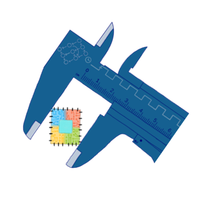

# Calipers 

Calipers is a tool for modeling processor performance through *event-dependence graphs*.
Calipers takes the program's dynamic instruction trace and a configuration file containing
microarchitectural and ISA specifications of the processor. It constructs a graph that models
the dependency and latency between microarchitectural events. Calipers then calculates the
performance (cycles per instruction) and provides the breakdown of bottlenecks through graph
analysis.

For more information, please refer to our publication,
"[Calipers: A Criticality-aware Framework for Modeling Processor Performance](https://dl.acm.org/doi/abs/10.1145/3524059.3532390)," in
*Proceedings of the 36th ACM International Conference on Supercomputing (ICS '22)*.
([extended version on arXiv](https://arxiv.org/abs/2201.05884))

A recording of the ICS'22 conference presentation is available on [YouTube](https://www.youtube.com/watch?v=harZF06MsKk).

## Build Instructions

The code has no particular dependencies and can be built with `make`:

```sh
git clone git@github.com:microsoft/calipers.git
cd calipers
make
```

The code has been built and tested on Ubuntu 18.04.

## Usage Instructions

```sh
./calipers config_file trace_file result_file
```

Example:

```sh
cd build
./calipers ../demo/InO.cfg ../demo/sample1.trace ./result_InO.txt
./calipers ../demo/OoO.cfg ../demo/sample2.trace ./result_OoO.txt
```
## Directory Structure

- `demo`: Contains sample configuration and trace files.
Please refer to [README.md](demo/README.md) under this directory for more details.
- `src`: Contains the source code of the project:
	- `branch_predictor`: Branch prediction information can be either provided through the trace
	or obtained from a model. The models are placed in this directory. Currently, it only
	contains a *statistical model* with configurable accuracy.
	- `common`: Contains the main and utility functions as well as defined constants and
	data types.
	- `graph`: Contains the graph-based modeler and analyzer for an in-order and an out-of-order
	processor. The latter also has a memory-efficient (advanced) implementation.
	- `memory`: Load and store information can be either provided through the trace
	or obtained from a model. The models are placed in this directory. Currently, it contains
	an *ideal model* (single-cycle loads/stores), a *statistical model* (configurable load/store
	hit rate and hit/miss cycles), and a *real model* (analytical two-layer cache with
	configurable size, associativity, and load/store hit/miss cycles).
	- `trace`: Contains the trace reader/parser. Currently, the RISC-V ISA is supported.

## Design Space Exploration

There are two ways for exploring new processor designs:
1. For a given processor model (such as the ones implemented in
[inorder_core_graph.cpp](src/graph/inorder_core_graph.cpp) and
[o3_core_graph.cpp](src/graph/o3_core_graph.cpp), the exposed parameters (such as the ones
specified in [InO.cfg](demo/InO.cfg) and [OoO.cfg](demo/OoO.cfg) for the implemented models)
can be varied to configure new designs.
2. A processor model in Calipers essentially consists of microarchitectural events (graph
vertices) and dependencies between them (graph edges and their weights) caused by data,
control, and structural hazards. Therefore, new processors can be modeled by varying the
events and/or dependencies between them. For example, in-order issue constraint is modeled
by:
```cpp
Vertex execute_vertex(VertexType::InstrExecute, instrCount);
Vertex prev_execute_vertex(VertexType::InstrExecute, instrCount - 1);
OutgoingEdge in_order_issue(execute_vertex, 0);
addEdge(prev_execute_vertex, in_order_issue);
```
in `modelPipeline` in [inorder_core_graph.cpp](src/graph/inorder_core_graph.cpp), whereas
out-of-order issue is modeled by first obtaining a scheduling list for the vertices of type
`VertexType::InstrExecute` in [o3_core_graph.cpp](src/graph/o3_core_graph.cpp) according to
data and control dependencies.

### Sample What-if Scenarios

Designers often face what-if scenarios when exploring new designs, e.g., how much a specific
component of the core is worth optimizing. Such scenarios can be evaluated in Calipers by
manipulating the graph vertices and edges and/or adjusting edge weights.

- Example 1: branch prediction.
As discussed in our paper, the effect of improving the branch predictor can be evaluated by
transforming the edge *E*<sub>*n*</sub> → *F*<sub>*n+1*</sub> to *F*<sub>*n*</sub> → *F*<sub>*n+1*</sub>,
where instruction *n* is a branch. Therefore, by
adjusting the `mispredicted` condition in the following code block (derived from `modelPipeline`
in [o3_core_graph.cpp](src/graph/o3_core_graph.cpp)), we can  model different scenarios.
For example, by setting `mispredicted` to `false` all the time, a perfect branch predictor is modeled.
```cpp
Vertex fetch_vertex(VertexType::InstrFetch, instrCount);
if (mispredicted)
{
    Vertex prev_branch_vertex(VertexType::InstrExecute, instrCount - 1);
    OutgoingEdge mispredicted_fetch(fetch_vertex, misprdecited_fetch_weight);
    addEdge(prev_branch_vertex, mispredicted_fetch);
}
else
{
    Vertex prev_fetch_vertex(VertexType::InstrFetch, instrCount - 1);
    OutgoingEdge in_order_fetch(fetch_vertex, in_order_fetch_weight);
    addEdge(prev_fetch_vertex, in_order_fetch);
}
```

- Example 2: value prediction.
Value prediction enables instructions to continue execution even before the source data,
particularly from an earlier load, is available. Since value prediction demands chip resources,
it is crucial to know which loads and what fraction of them should be value-predicted for higher
performance gains. Calipers models data dependency from instruction *n* to instruction *m* by the
edge *E*<sub>*n*</sub> → *E*<sub>*m*</sub>. Removing such an edge means instruction *n* is
correctly value-predicted. Different criteria for performing value prediction can be evaluated
by removing the corresponding edges. For example, setting `is_value_predicted` in the following
code block (derived from `trackDataDependencies` in
[o3_core_graph.cpp](src/graph/o3_core_graph.cpp)) should be done according a particular criterion
for selecting to-be-value-predicted loads.
```cpp
if (reg_written_by_load && !is_value_predicted)
{
    Vertex execute_vertex(VertexType::InstrExecute, instrCount);
    Vertex prev_mem_vertex(VertexType::MemExecute, load_num);
    OutgoingEdge dependence_edge(execute_vertex, data_weight);
    addEdge(prev_mem_vertex, dependence_edge);
}
```

### Leveraging Vectorization

Calipers introduces *vectorized* graphs, wherein a vector of weights instead of a scalar value
can be assigned to each edge. Vectorization allows multiple configurations to be modeled
and analyzed simultaneously. Using vectorization, Calipers does not need to construct the graph
from scratch in *N* separate runs, i.e., using *N* separate threads of execution, for *N*
configurations.

The width of the edge-weight vectors, `VECTOR_WIDTH`, is defined in
[calipers_defs.h](src/common/calipers_defs.h). As an example, assume that we want to model three
different decode cycles simultaneously. Therefore, `VECTOR_WIDTH` is set to 3. The decode edge
can be created as follows:
```cpp
Vertex fetch_vertex(VertexType::InstrFetch, instrCount);
Vertex dispatch_vertex(VertexType::InstrDispatch, instrCount);
int64_t decode_vec[VECTOR_WIDTH] = {base_weight, base_weight + 1, base_weight + 2};
OutgoingEdge fetch_after_dispatch(dispatch_vertex, Vector(decode_vec, VECTOR_WIDTH));
addEdge(fetch_vertex, fetch_after_dispatch);
```
In this example, other edges can be created as if their weights were scalars. For them, the
elements of the weight vector will have the same value.

## Contributing

This project welcomes contributions and suggestions.  Most contributions require you to agree to a
Contributor License Agreement (CLA) declaring that you have the right to, and actually do, grant us
the rights to use your contribution. For details, visit https://cla.opensource.microsoft.com.

When you submit a pull request, a CLA bot will automatically determine whether you need to provide
a CLA and decorate the PR appropriately (e.g., status check, comment). Simply follow the instructions
provided by the bot. You will only need to do this once across all repos using our CLA.

This project has adopted the [Microsoft Open Source Code of Conduct](https://opensource.microsoft.com/codeofconduct/).
For more information see the [Code of Conduct FAQ](https://opensource.microsoft.com/codeofconduct/faq/) or
contact [opencode@microsoft.com](mailto:opencode@microsoft.com) with any additional questions or comments.

## Trademarks

This project may contain trademarks or logos for projects, products, or services. Authorized use of Microsoft 
trademarks or logos is subject to and must follow 
[Microsoft's Trademark & Brand Guidelines](https://www.microsoft.com/en-us/legal/intellectualproperty/trademarks/usage/general).
Use of Microsoft trademarks or logos in modified versions of this project must not cause confusion or imply Microsoft sponsorship.
Any use of third-party trademarks or logos are subject to those third-party's policies.
